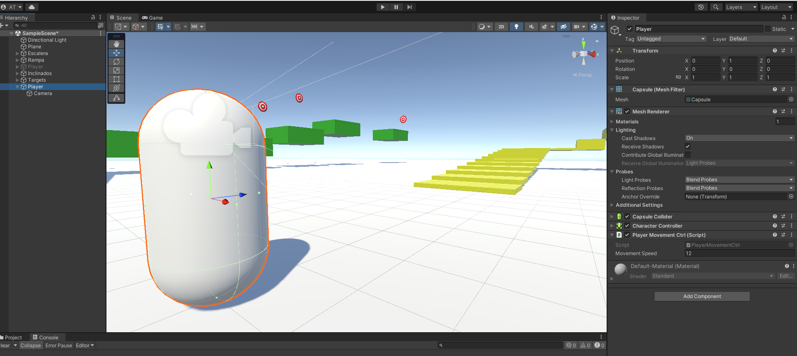
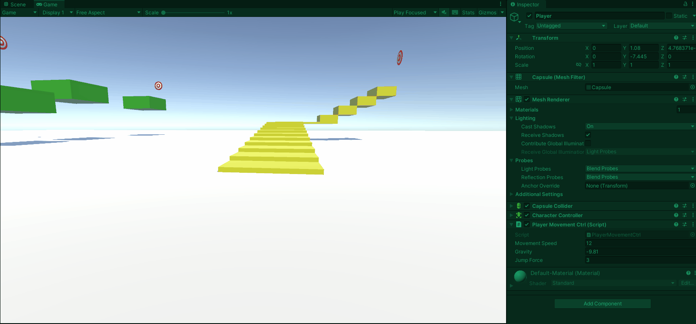
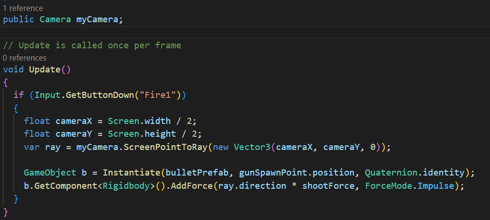

## Tabla de contenido
- [Introducción](#introducción)
- [First Person Controller (Setup)](#first-person-controller-setup)
  - [Setup](#setup)
  - [Escaleras](#escaleras)
  - [Plataformas](#plataformas)
  - [Inclinaciones](#inclinaciones)
  - [Targets](#targets)
- [First Person Controller](#first-person-controller)
  - [Movimiento de Cámara](#movimiento-de-cámara)
  - [Gravedad](#gravedad)
- [Proyectiles](#proyectiles)
- [Reto semanal](#reto-semanal)
- [Rescatando lo importante](#rescatando-lo-importante)
- [Bibliografía](#bibliografía)
  
Introducción
============
    

Bienvenido a este módulo, sin duda este es uno de los módulos más divertidos e interesantes del curso. Una de las características que más amamos de los videojuegos es su capacidad de hacer sentir al jugador que es parte de un mundo, que debe rescatar a una princesa, detener una guerra entre naciones  e incluso combatir una horda de demonios.

Uno de los géneros que ha tenido mayor éxito entre los jugadores es sin duda los First Person Shooter (FPS), también en sus variantes de acción en tercera persona. Mismos que aunque pueden tener un desarrollo frenético y lleno de acción, también pueden poner a pensar, reír y seguramente llorar (como aquel momento donde Dominic pierde a su amada esposa en Gears of Wars 2).

Hay un momento en estos juegos donde eres parte del todo, donde conoces hermanos de armas y se llevan a cabo las mejores partidas. En este módulo puedes llevar esto al siguiente nivel en donde no solo participas de las partidas, sino que puedes ser la piedra angular que diseñe y ejecute una visión de juego.

Verás solo una pequeña parte del universo que hay delante en este género, vas a plantar la semilla, y la tienes que cuidar para que dé sus mejores frutos.

First Person Controller (Setup)
================================
    

Lo primero que necesitas para crear un juego de tipo FPS es precisamente crear el First Person Controller, que significa crear el modelo de movimiento para el personaje.

Existen dos acercamientos diferentes para llegar a esta meta, el primero es desarrollar el movimiento del personaje a través de la implementación de fuerzas físicas, como lo hemos estado haciendo a través del uso del componente Rigidbody. Esto es de gran utilidad cuando quieres crear juegos más realistas.

El segundo acercamiento es hacer uso de una herramienta de Unity, el Character Controller que ya tiene resueltos varios de los requerimientos con los que te vas a enfrentar en un modelo de primera persona. Sin embargo, no está diseñado a través de simulaciones físicas. Esta opción es ideal si quieres lograr algo parecido a los juegos FPS de acción frenética como DOOM.

En este curso vas a comenzar con la segunda opción. Crearás tu propio modelo de First Person a partir de la herramienta del Character Controller.

Setup
-----
    

El primer requisito para construir el First Person Controller es crear un escenario que permita identificar las ventajas obtenidas al utilizar este componente.

Materiales:

Para identificar mejor los diferentes elementos debes crear algunos materiales que permitan cambiarles el color. Te proponemos los siguientes colores en materiales:

*   Verde
*   Rojo
*   Amarillo
*   Naranja
*   Blanco

\*Todos los materiales parten del Standard Shader, en caso de tener una escena de tipo URP hay que generarlos como tipo Lit.

Escaleras
------------

Debes crear una serie de escaleras que el jugador debe subir. El objetivo de estas escaleras es que tengan por lo menos dos diferentes alturas entre cada escalón. En el caso que se muestra, los primeros escalones tienen una altura de 0.1 entre ellos y los segundos de 0.25. También cambia la escala en Y para que los primeros sean muy delgados (0.1) y los segundos más grandes (0.5). El resultado esperado es el siguiente:

Plataformas
-----------

Crear una sección con plataformas sobre las que el jugador debe realizar sus saltos para llegar de un punto A a un punto B. El acomodo puede ser libre, solo deben tener espacio entre ellas para saltar de un punto a otro.

Inclinaciones
------------

Crear figuras con diferentes grados de inclinación para que el jugador pueda pasar a través de ellas. Se recomienda tener variaciones de inclinación de 10 en 10 grados, comenzando en -80 y siguiendo en -70. Así sucesivamente hasta llegar a la inclinación máxima de -50 o -45.

Targets
-----------

Crear un target para los impactos de proyectiles. Puedes hacerlo con figuras primitivas, usando una esfera y dejándola plana en el eje Z, posteriormente agrega esferas planas cada vez más grandes.

Ejemplo del acomodo visto desde el modo Wireframe

Finalmente, agrega el material rojo a los círculos correspondientes para lograr la siguiente figura.

\*Es importante retirar todos los Colliders y dejar solo uno, se recomienda poner todo dentro de un box collider.

Copia el target base y ponlo en distintas partes del nivel, lo más adecuado y sencillo para esta tarea es hacerlo un Prefab, de manera que puedes mantener el control de todas las copias.

\*El acomodo es libre, la muestra es solo ilustrativa.

First Person Controller
=======================
    

Para armar el First Person Controller, debes crear un cilindro e ir agregando en él todos los componentes necesarios.

*   Agrega un GameObject de tipo Cápsula.

*   Para que la cápsula deje de estar en el suelo basta con subirse en una unidad en Y.

*   A este GameObject agregale como hijo la cámara principal, de manera que siga el movimiento del jugador.

*   Y debe estar a 0.7 para que comparta la misma posición de la cabeza del jugador.

*   Agrega el componente Character Controller al cilindro principal.
*   Agrega un script para detectar el movimiento del personaje principal “PlayerMovementCtrl”.

El resultado debe ser algo parecido a lo que se muestra a continuación:

Ponte a prueba

En el script de movimiento vas a usar los conceptos que ya conoces e incorporar nuevos, especiales para el Character Controller.

*   Primero las variables.

*   Crea una variable pública para modificar la velocidad de movimiento del personaje, puedes iniciarla en 12.
*   Agrega una variable privada para acceder al componente de tipo Character Controller del Player
*   Agrega otra variable privada llamada velocity para guardar los cálculos del vector de movimiento resultante.

*   En el método Start debes obtener la referencia al componente de tipo Character Controller.

*   En el método Update vas a usar la ya conocida clase input con sus referencias a los ejes “Horizontal” y “Vertical” que te permiten identificar el desplazamiento que tendrá el objeto del jugador en los ejes X y Z.
*   Guarda el Vector3 resultante del movimiento en X y Z en una variable.
*   Finalmente, utiliza el método Move disponible del Character Controller para lograr el desplazamiento deseado.

*   El vector de dirección obtenido es multiplicado por la velocidad que deseas que tenga el movimiento y es escalado con la multiplicación ya conocida de Time.deltaTime para que el movimiento aplicado sea proporcional al tiempo transcurrido en cada cuadro.

La implementación de este código da como resultado lo siguiente:

\*Posiblemente te des cuenta que si moviste tu personaje junto a los obstáculos, el Player queda flotando en el aire, esto es porque aún no agregaste la lógica para controlar el salto o gravedad. Recuerda que el Character Controller no está diseñado para  funcionar con gravedad como la que obtienes con el componente Rigidbody. Sin embargo, vas a ver cómo implementar la gravedad en el Character Controller.

Movimiento de Cámara
--------------------

En este momento tienes el movimiento en dos ejes que te permiten desplazarte en el suelo con el personaje. Para complementar este movimiento vas a ajustar la cámara para controlar también hacia donde apunta la cámara.

Para entender el movimiento que deseas implementar, debes considerar lo siguiente:

*   Quieres que al mover el mouse en el eje X, el GameObject de tipo Player gire igual que cuando giras tu cabeza.
*   El desplazamiento en X del Mouse debe verse representado en el giro del eje Y del Player, justo como se muestra a continuación.

*   Para el movimiento del mouse en Y, quieres que la cámara gire en su eje X.
*   Es importante observar también que para la cámara, el desplazamiento del mouse debe interpretarse en dirección contraria para lograr que el desplazamiento sea hacia arriba cuando el mouse va hacia arriba.

Entendiendo estas necesidades, puedes armar el script “MouseCtrl” con las siguientes características.

*   Variables

*   Agrega una variable pública para establecer la sensibilidad del movimiento, esta será el equivalente a lo que usas normalmente para multiplicar la velocidad de movimiento o la fuerza de salto.
*   Agrega una variable pública para hacer referencia al GameObject Player (cilindro) para rotarlo cuando sea necesario.
*   Agrega una variable privada que contendrá el cálculo de la rotación en X.

*   Update

*   Lee los valores que arroja la lectura de la clase input para los eje X “Mouse X” y “Mouse Y” que ya están predefinidos en el input Manager.

*   Multiplica la lectura de los ejes por la sensibilidad, finalmente escala  con el Time.deltaTime.

*   Para la rotación de la cámara en el Eje X, leer el movimiento contrario del mouse en Y.

*   Utiliza la función Mathf.Clamp para identificar si el número indicado se encuentra dentro de un rango aceptable, en caso contrario regresará el valor máximo o mínimo establecidos.

*   Finalmente, usa el acceso a la posición rotación local para rotar la cámara en el ángulo necesario a través de la instrucción Quaternion.Euler que permite indicar los grados de rotación como si fuera un Vector3.
*   Para mover al jugador en el eje Y, únicamente es necesario utilizar la función Rotate y se desplazará en el eje Y dependiendo de la dirección del desplazamiento del mouse en el eje X.

Ahora vuelve a Unity, coloca el script en la cámara, realiza la referencia del Transform del GameObject Player para observar el resultado de la implementación.

Para la dirección del mouse en el Editor es importante dar click al panel Game, de manera que la lectura del movimiento se pueda leer correctamente. Esto último lo puedes evitar si agregas una instrucción al script para que al iniciar el juego, el mouse siempre sea capturado en esta ventana y seguir su desplazamiento.

Gravedad
--------

Como seguramente ya lo has notado, el GameObject carece de Rigidbody, por lo tanto no está siendo ejecutada de forma automática la tarea de calcular la gravedad para que el Player caiga al suelo luego de subir unas escaleras o cualquier otra superficie.

Para lograr este control de la gravedad, debes realizar los cálculos de forma manual, sin embargo lo harás de forma muy simple. También falta el movimiento de salto que es muy importante en algunos shooters con gran verticalidad.

Debes modificar el script “PlayerMovementCtrl” para agregar lo siguiente:

*   Variables.

*   Agrega una variable pública para indicar el valor de la fuerza de gravedad, por defecto tendrá el valor natural -9.81.
*   Variable pública para indicar la altura que deseas lograr cuando el Player realice su salto. Por defecto lo pondrás en 3.

*   Update.

*   En el método Update vas a agregar la lectura del input de tipo Button para el salto, usando el nombre predeterminado de “Jump” que permite saltar con la barra espaciadora.

*   Al presionar vas a modificar el vector de velocidad, únicamente en su componente Y que es el vertical.
*   Lo modificarás de acuerdo con la fórmula para calcular el salto de altura donde:

*   Finalmente, en el método Update restarás el factor de gravedad de cada cuadro escalando su resultado para cada tiempo que toma ejecutar cada frame.

Guarda los cambios, pasa a Unity y observarás el siguiente resultado:

Un resultado mucho más que satisfactorio, sin embargo, para aquellos más avispados seguro notaron un pequeño detalle: el Player puede saltar de forma infinita, es necesario agregar, como has hecho otras veces, la regla de un único salto.

A diferencia de otras ocasiones estás usando el componente CharacterController y evitas el uso de un Rigidbody, eso significa que no puedes detectar la colisión de la forma simple en donde usabas el Collider y el Rigidbody en el mismo GameObject, esto sucedería si agregas el componente Rigidbody.

Para hacer funcionar la detección de colisiones, debes usar otra estrategia un poco más rebuscada. Utilizarás la función Physics.CheckSphere, la cual permite crear una esfera en tiempo de ejecución y verificar si esta choca con cualquier otro objeto en la capa de colisión que le indiques.

La solución será pintar una esfera en la parte inferior del Player para verificar si la esfera entra en contacto con los elementos que agregues dentro de una capa que crearás para identificar aquellos elementos que son parte del “piso” donde puedes saltar.

Primero crea una nueva capa, dirígete a la sección de Layers y crea la capa “FloorMask”

Agrega esta capa a todos los GameObject que conforman tanto el piso como las plataformas y escaleras. Recuerda que puedes hacerlo mediante una selección múltiple.

Ahora que ya tienes la capa, agrega con fines prácticos un objeto visible para identificar la posición y radio de la esfera de detección.

*   Crea un GameObject de tipo Sphere y colócalo como hijo del Player, luego colócalo en la parte inferior en una posición de -0.6 en Y de manera que quede tocando el “piso”.
*   Puedes desactivar la malla para que no sea visible.
*   Es importante observar como su collider tiene un radio de 0.5 con el cual la esfera puede tocar el “piso”.

Ahora agrega las siguientes instrucciones al script “PlayerMovementCtrl”.

*   Variables.

*   Agrega una variable pública para colocar en ella la referencia al Transform de la esfera que creaste como referencia.
*   Agrega una variable pública para identificar la capa de colisión que usarás para identificar a los GameObject que forman parte del  “piso”.
*   Agrega una variable privada de tipo booleano para evaluar si estás tocando el “piso”.

*   Update

*   En el método Update la lógica será sencilla puesto que ya tienes todos los datos de entrada para procesarlos.
*   Asigna cada frame a la variable isGrounded el resultado de Pyshics.CheckSphere, es decir, de la detección de colisión de la esfera.

*   Para crear la esfera será necesaria la posición del GameObject que creaste como referencia.
*   Agrega el tamaño de la esfera, que será igual al tamaño del radio de collider del GameObject de referencia.
*   Finalmente, agrega la capa de colisión con la que deseas revisar si hay una colisión.

*   Ahora solo agrega al bloque condicional del salto la revisión de tipo AND para verificar si la variable isGrounded es también verdadera.

*   En caso de que el salto se lleve a cabo, vas a hacer falsa la variable isGrounded, esto indicará que dejaste de tocar el suelo.
*   Cuando caigas, la esfera de colisión detectará el suelo y volverás a tener un valor verdadero en isGrounded.

Si guardas el script y vas al Editor, vas a completar la información que agregaste, entrarás en Playmode y luego deberás probar el resultado.

Ahora tienes el Character Controller completamente funcional, ¡estás listo para la aventura!

Algo interesante y propio del Character Controller es que puedes ajustar dos de sus parámetros para que el personaje se pueda desplazar correctamente entre diferentes escenarios.

*    Slop Limit.

*   Este parámetro permite indicar qué tan inclinado puede estar un plano, pero seguirá permitiendo al jugador pasar sobre él.

*   Step Offset.

*   Este parámetro permite indicar qué tan alto puede pasar objetos el Character Controller como si fueran escalones o simples objetos tirados.

Las dos características son muy importantes, se deben tomar en cuenta a la hora de diseñar elementos para que el jugador pueda caminar dentro de los juegos.

Proyectiles
============
    

La generación de proyectiles es algo que ya has trabajado en varias ocasiones, especialmente para proyectos 2D. La lógica para generar los disparos es la misma que has conoces hasta el momento.

En primer lugar, tómate tu tiempo para encontrar un modelo de arma que te guste para el juego, recuerda que si no tienes conocimientos para hacer tus propios assets de forma manual, puedes acudir a cualquiera de los siguientes sitios para obtenerlos gratuitos para pruebas en tus proyectos.

*   [https://assetstore.unity.com/](https://assetstore.unity.com/)
*   [https://itch.io/](https://itch.io/)
*   [https://www.models-resource.com/](https://www.models-resource.com/)
*   [https://www.turbosquid.com/](https://www.turbosquid.com/)

Como ejemplo te proponemos usar el siguiente modelo de Asset Store: [https://assetstore.unity.com/packages/3d/props/guns/sci-fi-gun-162872](https://assetstore.unity.com/packages/3d/props/guns/sci-fi-gun-162872&sa=D&source=editors&ust=1681193078582918&usg=AOvVaw3isZ95kpvR5MY4qLOFp1w1)

Adquiere este modelo a través de la Asset Store y pide que sea abierto en Unity.

En Unity se abrirá de forma automática el panel de Package Manager, el cual maneja todos los paquetes instalados en el proyecto, además de todos los paquetes que has adquirido en la tienda, pero que aún no se encuentran instalados en el proyecto, tal es el caso de este nuevo asset.

Para instalarlo solo hace falta dar click en la opción de importar –cuando aún no tienes descargado el paquete, la opción es Download–. Se abre una ventana adicional indicando todos los elementos que vas a importar con este paquete, en esta ventana vas a presionar también la opción de importar.

\*En este punto es muy importante saber que hay assets que pueden usar “Render Pipeline” distinto al que usas. Cuando esto sucede es posible que Unity intente configurar todo para poder visualizar correctamente el modelo que vas a importar, sin embargo, esto puede provocar que los modelos en la escena se vuelvan de color magenta indicando que no tienen una configuración visual (material) adecuada para el “Render Pipeline” actual.

Es recomendable utilizar modelos que puedan ser interpretados con la configuración básica de 3D de tu proyecto. Sin embargo, si tienes este problema y deseas conservar tus assets, te recomendamos seguir el siguiente tutorial para que puedas cambiar tus materiales, esta es la solución en la mayoría de las veces que ocurre.

[https://www.youtube.com/watch?v=lFUoJ2Td4tM&ab\_channel=Gunzz](https://www.youtube.com/watch?v%3DlFUoJ2Td4tM%26ab_channel%3DGunzz)

Si elegiste usar el modelo propuesto e importaste todos los archivos, solo necesitas encontrar dentro de los archivos el Prefab de tu modelo que ya tiene todo lo necesario aplicado y pasarlo a la escena.

Para la programación del arma, primero debes hacer un correcto posicionamiento de ella. El objetivo es que el arma siga tu mirada dentro del juego como cualquier otro FPS.

)

Soluciónalo con la técnica del emparentamiento de manera que el seguimiento de la posición se haga automáticamente.

Simplemente organiza el elemento en el panel Hierarchy para que la pistola esté dentro de la cámara, después jugarás con su posición hasta que quede en el rango visible –esto lo puedes comprobar en la ventana GAME– y únicamente ajustarla al área que más te acomode.

Ahora pasemos directamente a crear el proyectil y a disparar con cada click, ya sabes resolver esta tarea.

*   Agrega a la escena una esfera cuyo tamaño pueda entrar en la punta de la pistola.
*   Agrega un material para identificar la bala, se recomienda un color rojo.
*   Agrega el componente Rigidbody.
*   Haz del GameObject un Prefab.
*   Proyectil listo.

Ahora es necesario crear el script que permitirá disparar el proyectil “GunCtrl”.

*   Crea el script “GunCtrl”.
*   Variables.

*   Crea una variable pública que obtenga el Transform para guardar la referencia de la posición de la punta de la pistola.

*   El modelo propuesto viene en partes, una relevante es la punta de la pistola. Para poder hacer un buen efecto de disparo, si tu modelo no la tiene, recuerda que puedes crear una con un objeto vacío y haciendo un posicionamiento/emparentamiento correcto.

*   Crea una variable pública para tener una referencia a un GameObject del proyectil que vas a instanciar.
*   Crea una variable pública que permita modificar la fuerza con la que disparas el proyectil.

*   Update.

*   Lo que agregarás solo será la función Input.GetButtonDown(“Fire1”) para detectar los clicks izquierdos del mouse o los otros botones configurados para este botón virtual –joystick button 0, mouse 0, mejor conocido como click izquierdo, y finalmente left ctrl–.
*   Cuando detectes el click, vas a usar la función Instantiate para crear un nuevo proyectil justo en la cabeza de la pistola.
*   Agrega finalmente una fuerza en la dirección hacia la que apunta la pistola.

En este caso utiliza el ForceMode.Impulse ya que solo agregarás una fuerza (explosiva) al inicio del disparo.

Algo muy importante que puede causar problemas es la dirección del disparo. Si agregas una dirección estática de forma global, por ejemplo, el Vecto3.Fordward, tendrás un disparo que irá en una sola dirección y puede ser distinta de donde estás enfocando la cámara. Para resolverlo debes usar una dirección relativa que depende de hacia donde está apuntando la punta de la pistola.

Aprovecha el momento para crear un pequeño script en los proyectiles con el objetivo de desaparecerlos cuando choquen con cualquier cosa y que indiquen el nombre del GameObject con el que chocaste.

Agrega estos scripts a los GameObject correspondientes, así podrás obtener el siguiente resultado.

Como cereza del pastel puedes agregar rápidamente la función para que destruya los targets cuando el proyectil choque con ellos.

*   Crea una etiqueta que se llame target.
*   Agrégala a todos los GameObject de tipo target.

*   Puedes hacer una selección múltiple o agregarla al Prefab base y sobrescribir todos.

*   Agrega una condicional en el script de la bala para identificar si el GameObject con el que chocaste tiene el tag de target.
*   Si es así, destruye el target también.

Ya tienes los elementos básicos para comenzar a desarrollar un FPS, sin embargo, hace falta un par de mejoras de calidad de vida, una que es indispensable trabajar es una mira. Existen varias soluciones que puedes aplicar, la más sencilla es crear un GameObject de referencia que esté siempre al centro de la pantalla y hacer que la pistola siempre apunte y dispare en esta dirección.

La mejor solución es utilizar una herramienta que tienen las cámaras en Unity: crear rayos, mejor conocidos como RayCast. Estos rayos pueden servir para disparar eventos específicos cuando algo se encuentre en tu pantalla, sin embargo, usarás solo una pequeña parte de este potencial, aunque te recomendamos que [leas sobre el tema](https://docs.unity3d.com/ScriptReference/Physics.Raycast.html).

Para integrarlo a tu proyecto, debes seguir los siguientes pasos:

*   Modifica el script “GunCtrl”.
*   Agrega una variable pública para tener una referencia a la cámara que va a disparar el rayo.
*   En el método Update agrega la lógica para crear un rayo que apunte a la mitad de la pantalla usando el método [ScreenPointToRay](https://docs.unity3d.com/ScriptReference/Camera.ScreenPointToRay.html).
*   Cambia la dirección en la que aplicaste la fuerza para que se dirija hacia la dirección del rayo.
*   Adicionalmente, agrega al BulletCtrl un llamado al método Destroy después de dos segundos de ser creado un proyectil. Esto para incrementar la fuerza y dar en el blanco de los targets, y para que la bala no colisione con nada y siga viva en el juego.
*   También te recomendamos agregar un [indicador de target](https://pngfreepic.com/freepng/target-icon-transparent-bg-png/) a la vista a través de UI.

¡Ahora sí!, el juego se siente mucho mejor. Aún falta aprender sobre varios temas, mismos que conocerás en las siguientes semanas.

Reto semanal
============
    

El reto de esta semana consiste en agregar a tu juego creado la capacidad para:

*   UI.

*   Contar cuantos targets tienes para pedirte que logres eliminar todos.
*   Un contador de tiempo para eliminar los más posibles en menos de un minuto.

*   Animación.

*   Agregar animaciones sencillas a algunos targets para que se encuentren en movimiento.

*   Ambiente.

*   Utiliza algún escenario gratuito de la Unity Asset Store para darle un mejor aspecto a tu juego, aquí te proponemos algunos.

*   [https://assetstore.unity.com/packages/3d/environments/urban/abandoned-asylum-49137](https://assetstore.unity.com/packages/3d/environments/urban/abandoned-asylum-49137)
*   [https://assetstore.unity.com/packages/3d/environments/landscapes/low-poly-simple-nature-pack-162153](https://assetstore.unity.com/packages/3d/environments/landscapes/low-poly-simple-nature-pack-162153)
*   [https://assetstore.unity.com/packages/3d/environments/3d-free-modular-kit-85732](https://assetstore.unity.com/packages/3d/environments/3d-free-modular-kit-85732)
*   [https://assetstore.unity.com/packages/3d/environments/sci-fi/sci-fi-styled-modular-pack-82913](https://assetstore.unity.com/packages/3d/environments/sci-fi/sci-fi-styled-modular-pack-82913)

*   Audio.

*   Agrega audio a tu juego para que se escuchen sonidos especiales al disparar y cuando la bala alcance a los targets.

*   Optimización.

*   Agrega la lógica necesaria al juego para utilizar Pooling en los disparos.

Rescatando lo importante
=========================
    

Esperamos que toda esta información te resulte muy útil y te anime a seguir practicando para mejorar. En esta semana aprendiste sobre los siguientes conceptos:

*   Character Controller.
*   Colliders.
*   Rigidbody.
*   Camera Ray.
*   Tags.
*   AddForce.

La próxima semana verás temas muy interesantes para crear enemigos más complejos en comparación con los targets iniciales. Recuerda esforzarte mucho, descansa, juega y sigue aprendiendo.

Bibliografía
=============
    

Camera.ScreenPointToRay. (s. f.). Unity Documentation. [https://docs.unity3d.com/ScriptReference/ForceMode.html](https://docs.unity3d.com/ScriptReference/ForceMode.html)

[https://docs.unity3d.com/ScriptReference/Camera.ScreenPointToRay.html](https://docs.unity3d.com/ScriptReference/Camera.ScreenPointToRay.html)

Character Controller component reference. (s. f.). Unity Documentation. [https://docs.unity3d.com/Manual/class-CharacterController.html](https://docs.unity3d.com/Manual/class-CharacterController.html)

CursorLockMode.Locked. (s. f.). Unity Documentation. [https://docs.unity3d.com/ScriptReference/CursorLockMode.Locked.html](https://docs.unity3d.com/ScriptReference/CursorLockMode.Locked.html)

Mathf.Clamp. (s. f.). Unity Documentation. [https://docs.unity3d.com/ScriptReference/Mathf.Clamp.html](https://docs.unity3d.com/ScriptReference/Mathf.Clamp.html)

Physics.CheckSphere. (s. f.). Unity Documentation. [https://docs.unity3d.com/ScriptReference/Physics.CheckSphere.html](https://docs.unity3d.com/ScriptReference/Physics.CheckSphere.html)

Physics.Raycast. (s. f.). Unity Documentation. [https://docs.unity3d.com/ScriptReference/Physics.Raycast.html](https://docs.unity3d.com/ScriptReference/Physics.Raycast.html)

Render pipelines introduction. (s. f.). Unity Documentation. [https://docs.unity3d.com/Manual/render-pipelines-overview.html](https://docs.unity3d.com/Manual/render-pipelines-overview.html)